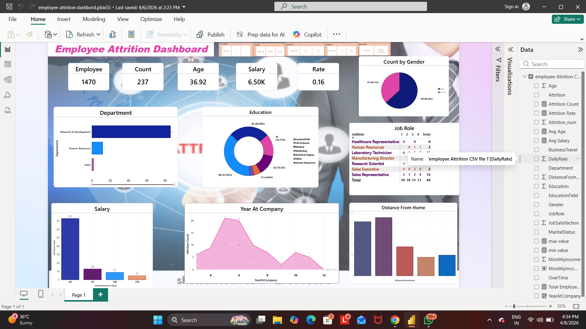

# Employee-Attrition-Dashboard
power BI dashboard analyzing employee attrition 
## 📊 Project Overview
This project analyzes employee attrition using Power BI. It helps identify key factors that influence employee turnover.

## 🛠 Tools Used
- Microsoft Power BI

## 📈 Key Insights
- Attrition rate analysis
- Department-wise attrition
- Salary impact on attrition
- Age and experience trends

## 📷 Dashboard Preview

## 📁 Files Included
- employee attrition dashboard.pbix

## 🔗 Project Link
(# Employee Attrition Dashboard

## 📊 Project Overview
This project analyzes employee attrition using Power BI. It helps identify key factors that influence employee turnover.

## 🛠 Tools Used
- Microsoft Power BI

## 📈 Key Insights
- Attrition rate analysis
- Department-wise attrition
- Salary impact on attrition
- Age and experience trends

## 📷 Dashboard Preview
(Add your dashboard screenshot here)

## 📁 Files Included
- employee attrition dashboard.pbix

## 🔗 Project link
# Employee Attrition Dashboard

## 📊 Project Overview
This project analyzes employee attrition using Power BI. It helps identify key factors that influence employee turnover.

## 🛠 Tools Used
- Microsoft Power BI

## 📈 Key Insights
- Attrition rate analysis
- Department-wise attrition
- Salary impact on attrition
- Age and experience trends

## 📷 Dashboard Preview
(Add your dashboard screenshot here)

## 📁 Files Included
- employee attrition dashboard.pbix

## 🔗 Project Link
https://github.com/lavatedipali05-arch/Employee-Attrition-Dashboard
